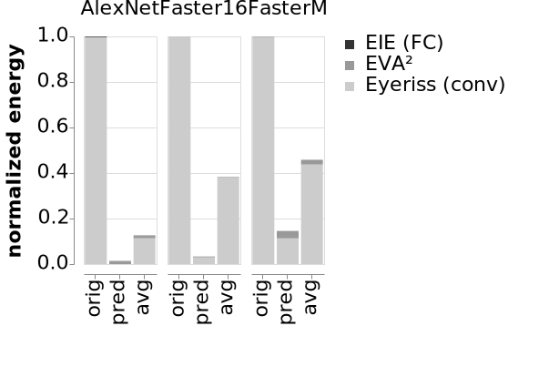

# Exploiting Temporal Redundancy for Live Computer Vision

The architecture world is abuzz with hardware accelerators for deep convolutional neural networks (CNNs).
Most proposals, however, target general CNNs as a black box.
We see an opportunity to make CNN accelerators vastly more efficient by exploiting the unique characteristics of a critical domain for CNN hardware: real-time, embedded vision.
When they process real-time video, vision networks ingest nearly-identical frames at each time step.
Our technique, *activation motion compensation*, exploits this temporal redundancy.
It detects changes in the visual input and incrementally updates its previous output.

The technique borrows ideas from video compression, which also works by measuring changes in input frames.
CNN execution proceeds normally during occasional *key frames* and uses approximate, incremental updates for most frames, called *predicted frames*.
The first step is *motion estimation*, which computes a vector field representing the visual motion between frames.
We develop a new, hardware-optimized motion estimation algorithm that can be customized for any CNN structure.
Next, *motion compensation* translates components in a CNN activation based on the motion in the input frame.
The overall effect is that the CNN implementation can skip a prefix of CNN layers and predict the input to the remaining layers.
To control the prediction's impact on vision accuracy, we dynamically adapt the key frame rate based on the magnitude of motion in the input.

<figure>
  
  <figcaption>
    The average energy cost per frame for the original accelerator (orig), predicted EVA² frames (pred), and all frames with EVA² (avg).
  </figcaption>
</figure>

We implement activation motion compensation as a small hardware block, called EVA², that augments existing hardware for executing neural network layers.
We synthesize EVA² itself from RTL and use a [first-order model][fodlam] of hardware accelerators for convolutional layers ([Eyeriss][]) and fully-connected layers ([EIE][]).
Our new hardware occupies less than 4% of the full accelerator's area but saves between 54% and 88% of the average frame processing energy on three CNNs while incurring less than 1 percentage point loss in vision accuracy.

[eyeriss]: http://eyeriss.mit.edu
[eie]: https://dl.acm.org/citation.cfm?id=3001163
[fodlam]: https://github.com/cucapra/fodlam

## Publication

Mark Buckler, Philip Bedoukian, Suren Jayasuriya, and Adrian Sampson.
"EVA²: Exploiting Temporal Redundancy in Live Computer Vision."
To appear in the International Symposium on Computer Architecture (ISCA), 2018.

<ul class="links">
  <li><a href="/pubs/eva2-isca2018.pdf" class="pdf">ISCA preprint</a></li>
</ul>



    @inproceedings{buckler-isca2018,
        author = {Mark Buckler and Philip Bedoukian and Suren Jayasuriya
                  and Adrian Sampson.},
        title = {{EVA}$^2$: Exploiting Temporal Redundancy in
                 Live Computer Vision},
        booktitle = {International Symposium on Computer Architecture (ISCA)},
        year = {2018},
    }



## Talk

Watch the [video of the talk at ISCA 2018][talk].
You can also watch the two-minute [lightning talk video][lightning].

<iframe width="560" height="315" src="https://www.youtube-nocookie.com/embed/IX-xfBTcPyo" frameborder="0" allow="autoplay; encrypted-media" allowfullscreen></iframe>

[talk]: https://youtu.be/IX-xfBTcPyo
[lightning]: https://youtu.be/rhMI5u6Qlv8

## Contact

* [Mark Buckler][mark] &lt;<mab598@cornell.edu>&gt;
* Philip Bedoukian &lt;<pbb59@cornell.edu>&gt;
* [Suren Jayasuriya][suren] &lt;<sjayasur@asu.edu>&gt;
* [Adrian Sampson][adrian] &lt;<asampson@cs.cornell.edu>&gt;

[mark]: http://www.markbuckler.com
[suren]: http://www.andrew.cmu.edu/user/sjayasur/website.html
[adrian]: http://www.cs.cornell.edu/~asampson/

## Acknowledgments

This work was supported by a gift from [Huawei](http://www.huawei.com/) and a GPU donated by [Nvidia](https://developer.nvidia.com/academic_gpu_seeding).
