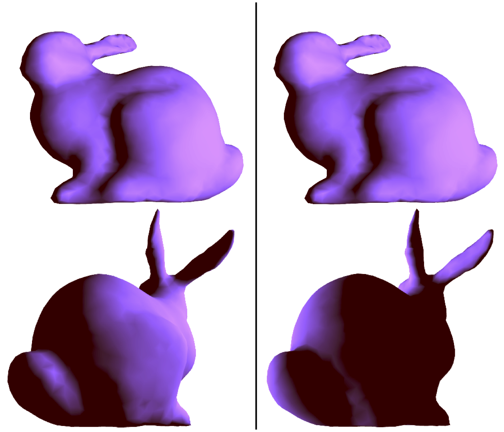
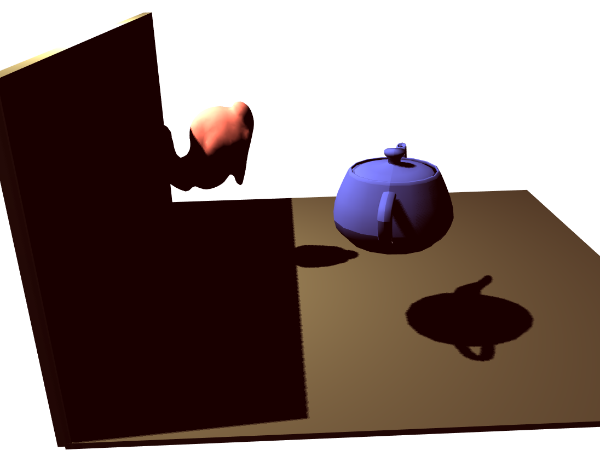

This work identifies a new category of bugs in graphics software and other geometry-heavy code:
*geometry bugs* arise when confusing the many different coordinate systems that underpin a computation.
In the GPU shading language [GLSL][], for example, two different values with the same type, `vec3`, can represent different kinds of geometric objects (positions, directions…), coordinate representation schemes (Cartesian, polar…), or reference frames (object-relative, world-relative, …).
Mixing up these different kinds of values can lead to geometrically meaningless results and subtle, hard-to-test-for visual defects.

<figure>
  
  <figcaption>
    Geometry bugs can yield subtly incorrect visual output and can be hard to catch in testing.
    The right-hand output depicts a geometry bug that is only visible from some angles on the model.
  </figcaption>
</figure>

Gator is a programming language that adds *geometry types* to catch this category of bug.
Geometry types encode the reference frame and coordinate scheme of each kind of geometric object.
Geometry types can be "compiled away" to plain computational types like `vec3`, but type-checking them rules out subtle confusions at compile time.

Gator's type system lets it support *automatic generation* of correct-by-construction transformation.
Instead of writing a matrix–vector multiplication like `modelToWorld * modelVtx` to convert a vector from model to world coordinates, programmers can write `modelVtx in world` to automatically generate the right transformation code.
Gator searches the graph of available type conversions to find a path between any two types.

The Gator project includes work on the semantics of geometry types and associated automatic transformations and includes work on creating a compiler from the Gator language to [GLSL][] and [TypeScript][].
This compiler is [publicly available on GitHub][gh] and allows for creation of custom user types and for defining internally necessary functions, such as GLSL-style vector operations.
Work on Gator is ongoing, and we appreciate contributions and suggestions.

[gh]: https://github.com/cucapra/gator
[glsl]: https://www.khronos.org/opengl/wiki/Core_Language_(GLSL)
[typescript]: https://www.typescriptlang.org

## Publications

Dietrich Geisler, Irene Yoon, Aditi Kabra, Horace He, Yinnon Sanders, and Adrian Sampson.
"Geometry Types for Graphics Programming."
In OOPSLA 2020.

<ul class="links">
  <li><a href="https://www.cs.cornell.edu/~asampson/media/papers/gator-oopsla2020-preprint.pdf" class="pdf">OOPSLA paper preprint</a></li>
</ul>

    @inproceedings{geisler-splash2020,
        author = {Dietrich Geisler and Irene Yoon and Aditi Kabra and
            Horace He and Yinnon Sanders and Adrian Sampson},
        title = {Geometry Types for Graphics Programming},
        booktitle = {OOPSLA},
        year = {2020},
    }

Aditi Kabra, Dietrch Geisler, and Adrian Sampson.
"Online Verification of Commutativity."
In TAPAS 2020.

    @inproceedings{kabra-tapas2020,
        author = {Aditi Kabra and Dietrch Geisler and Adrian Sampson},
        title = {Online Verification of Commutativity},
        booktitle = {Workshop on Tools for Automatic Program Analysis (TAPAS)},
        year = {2020},
    }

## Code

<figure>
  
  <figcaption>
    The Gator compiler includes examples of several common rendering effects, including shadow mapping.
  </figcaption>
</figure>

Check out the [open-source OCaml implementation][gh] of the Gator compiler.
The compiler type-checks Gator programs and emits them as either GLSL or TypeScript.
It comes with a repository of [example Gator code][ex] that reflects the case studies in the OOPSLA paper.
The license is [MIT][].

[gh]: https://github.com/cucapra/gator
[ex]: https://github.com/cucapra/gator/tree/master/examples
[mit]: https://opensource.org/licenses/MIT
[gh]: https://github.com/cucapra/approx-vision

## Contact

* [Dietrich Geisler][dietrich] &lt;<dag368@cornell.edu>&gt;
* [Adrian Sampson][adrian] &lt;<asampson@cs.cornell.edu>&gt;

[dietrich]: https://www.cs.cornell.edu/~dgeisler/
[adrian]: http://www.cs.cornell.edu/~asampson/

## Acknowledgments

This work was supported by [the NSF][nsf] and [the Applications Driving Architectures (ADA) center][ada].

[nsf]: https://www.nsf.gov
[ada]: https://adacenter.org
