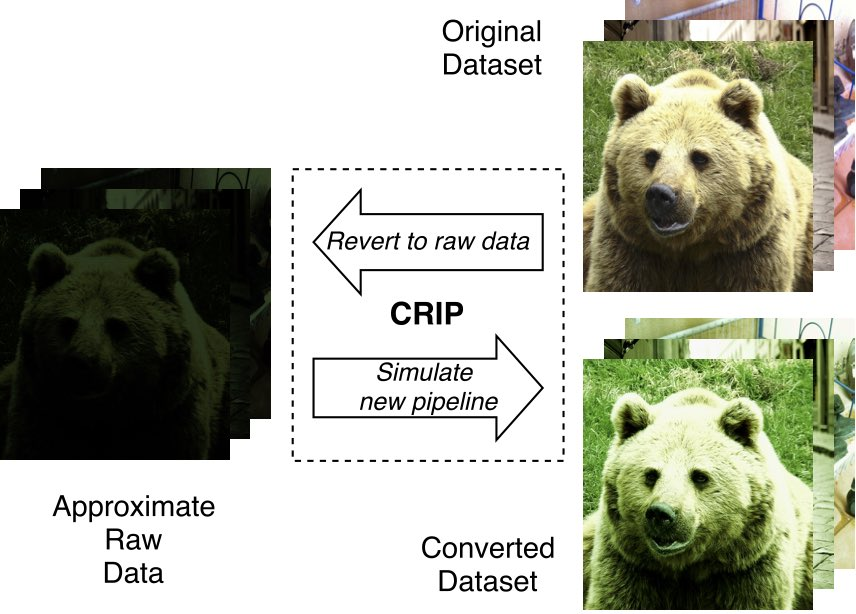

# Reconfiguring the Imaging Pipeline for Computer Vision

Most camera systems today are optimized for photography.
They expend time and energy to produce high-quality images that humans will enjoy.
This pristine quality is wasted, however, when the goal is computer vision instead of human consumption.
We argue that camera pipelines should be configurable: they should be able to switch between a traditional *photography mode* and a low-power *vision mode* that produces raw image data suitable only for computer vision.

<figure>
  
  <figcaption>
    Vision quality impact for our proposed camera pipeline in vision mode.
    The second group shows a pipeline with only demosaicing and gamma compression enabled, and the third also enables denoising.
  </figcaption>
</figure>

Our work takes an empirical approach to measuring the costs and benefits for a vision mode.
We use eight computer vision algorithms, including both classical algorithms and convolutional neural networks, and we measure the impact on vision quality when we simulate low-power camera pipelines.
The results suggest that most standard stages in [image signal processing (ISP)][isp] chips are unnecessary when capturing images for vision.
All but one of the benchmarks we measured (and all of the CNN-based benchmarks) exhibited sensitivity to only two traditional ISP stages: [demosaicing][] and [gamma correction][gamma].

We also propose modifications to the camera sensor itself to improve the efficiency of capture in vision mode.
Using a subsampling technique, our sensor design can elicit most of the important effects of demosaicing without any signal processing.
In addition, we use nonlinear [analog-to-digital converters (ADCs)][adc] to replace the effects of gamma correction, thereby reducing the number of bits which need to be captured per pixel.
Together, these changes lead to cheaper data readout and can obviate the need for a separate ISP chip.

Initial figures suggest that a vision mode may save roughly three quarters of the energy spent on the camera and ISP for image capture in a traditional system.

[isp]: https://en.wikipedia.org/wiki/Image_processor
[demosaicing]: https://en.wikipedia.org/wiki/Demosaicing
[gamma]: https://en.wikipedia.org/wiki/Gamma_correction
[adc]: https://en.wikipedia.org/wiki/Analog-to-digital_converter

## Publication

Mark Buckler, Suren Jayasuriya, and Adrian Sampson.
Reconfiguring the Imaging Pipeline for Computer Vision.
In the IEEE International Conference on Computer Vision (ICCV), 2017.

[preprint PDF][paper], [supplementary material PDF][supp]

    @inproceedings{buckler-iccv2017,
        author = {Mark Buckler and Suren Jayasuriya and Adrian Sampson},
        title = {Reconfiguring the Imaging Pipeline for Computer Vision},
        booktitle = {The IEEE International Conference on Computer Vision (ICCV)},
        year = {2017},
    }

[paper]: /pubs/visionmode-iccv2017.pdf
[supp]: /pubs/visionmode-iccv2017-supplemental.pdf

## Code

<figure>
  
  <figcaption>
    Our open-source tool can convert image datasets to simulate the effects of novel camera pipelines.
  </figcaption>
</figure>

We have released a set of [open-source tools][gh] for modeling approximate camera pipelines.
The main component is the forward and backward simulation of a camera sensor and ISP chip, referred to as the "CRIP" in the [paper][].
The backward mode can convert from a standard image (i.e., a JPEG) into an approximation of its original RAW format.
Then, you can run the pipeline *forward* again to convert the image to what it would have looked like had it been captured with a hypothetical pipeline configuration.
We use this tool to convert standard vision datasets like [ImageNet][], [CIFAR][], and [COCO][] to degraded versions for the purpose of training and testing computer vision algorithms.

[imagenet]: http://www.image-net.org
[cifar]: https://www.cs.toronto.edu/~kriz/cifar.html
[coco]: http://mscoco.org

Check out the source from the [repository on GitHub][gh].
The conversion tool is mainly written in [Halide][] with some auxiliary support scripts.
The camera model is based on [this paper by Kim et al.][kim] (for details, see this [CVPR 2016 tutorial by Michael S. Brown][brown]).
The license is [MIT][].

[mit]: https://opensource.org/licenses/MIT
[gh]: https://github.com/cucapra/approx-vision
[halide]: http://halide-lang.org
[kim]: http://ieeexplore.ieee.org/document/6158647/
[brown]: http://www.eecs.yorku.ca/~mbrown/CVPR2016_Brown.html

## Results and Visualizations

We collected a lot of vision task accuracy data to study the potential for a vision mode.
The raw data and plotting infrastructure for all these results is [on GitHub][plot-gh].
You can use this repository to reproduce all the charts in the paper.

Because we had trouble deciding which kinds of plots to include in the paper, we have many other visualizations for the same data.
Thanks to the magic of [Vega-Lite][], you can see in-browser, interactive plots with fancy tooltips.
View a [main set of plots](https://capra.cs.cornell.edu/vision-plots/), a grid of [single-benchmark plots](https://capra.cs.cornell.edu/vision-plots/singles.html), or our [quantization and resolution sweeps](https://capra.cs.cornell.edu/vision-plots/sweeps.html).

[plot-gh]: https://github.com/cucapra/vision-plots
[vega-lite]: https://vega.github.io/vega-lite/

## Contact

* [Mark Buckler][mark] &lt;<mab598@cornell.edu>&gt;
* [Suren Jayasuriya][suren] &lt;<sjayasur@asu.edu>&gt;
* [Adrian Sampson][adrian] &lt;<asampson@cs.cornell.edu>&gt;

[mark]: http://www.markbuckler.com
[suren]: http://www.andrew.cmu.edu/user/sjayasur/website.html
[adrian]: http://www.cs.cornell.edu/~asampson/
